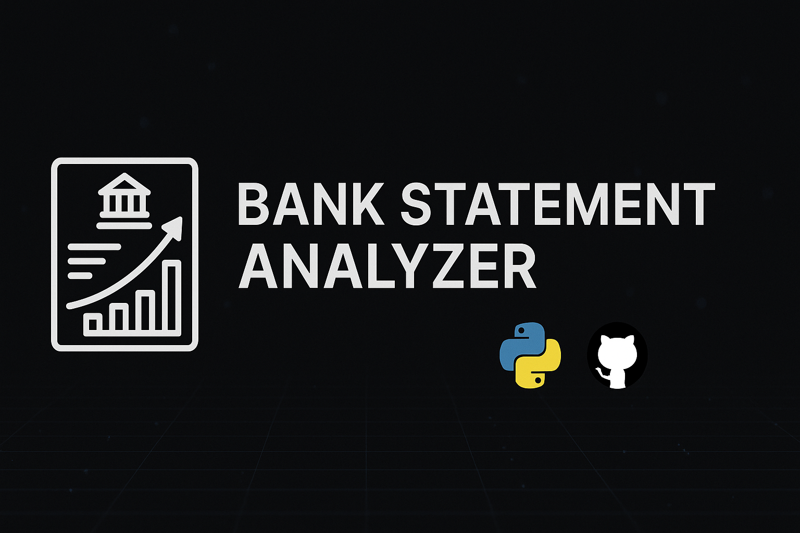

  

# 🧾 Bank Statement Analyzer

A lightweight Python tool to extract transactions from bank statement PDFs, clean and structure the data, and prepare it for analysis or visualization (e.g., with Power BI or Excel).

---

## 🚀 Features

- Extracts transaction lines from text-based PDF statements  
- Cleans and normalizes dates, amounts, and descriptions  
- Converts messy lines into structured CSV format  
- Merges multiple statement files into a single dataset  

---

## 📂 Project Structure

Bank-Statement-Analyzer/
├── assets/ # Banner and other static assets
├── data/
│ ├── raw_pdfs/ # 🔒 Your original PDF statements (ignored by Git)
│ ├── cleaned_data/ # Auto-generated cleaned CSV files
│ ├── extracted_csvs/ # Intermediate extracted CSVs (optional)
│ └── all_statements_merged.csv # Final merged output
├── scripts/
│ └── process_bank_statement.py # Main processing script
├── .gitignore
├── requirements.txt
└── README.md

---

## 🛠️ Usage

1. Place your bank PDFs into `data/raw_pdfs/`
2. Run the script:
python scripts/process_bank_statement.py

Outputs:

Cleaned monthly CSVs → data/cleaned_data/

Merged CSV for analysis → data/all_statements_merged.csv

📊 Sample Output
date	description	amount
2025-05-06	CARTE 1234 AMAZON.FR	-32.90
2025-05-07	VIREMENT SALAIRE	1500.00
2025-05-08	ABONNEMENT NETFLIX	-13.49

📦 Requirements
Python 3.10+
pdfplumber
pandas

Install dependencies:
pip install -r requirements.txt
